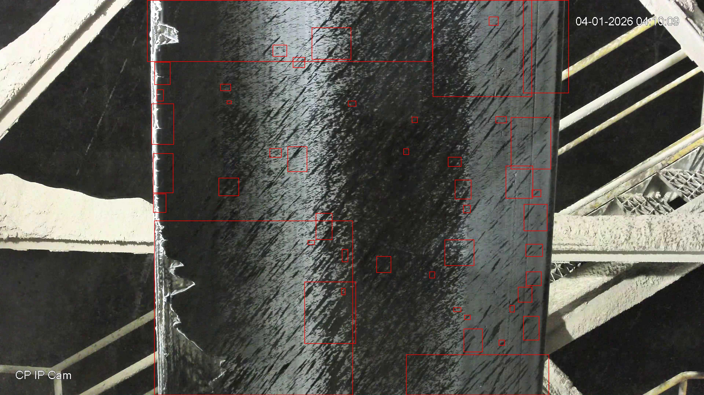
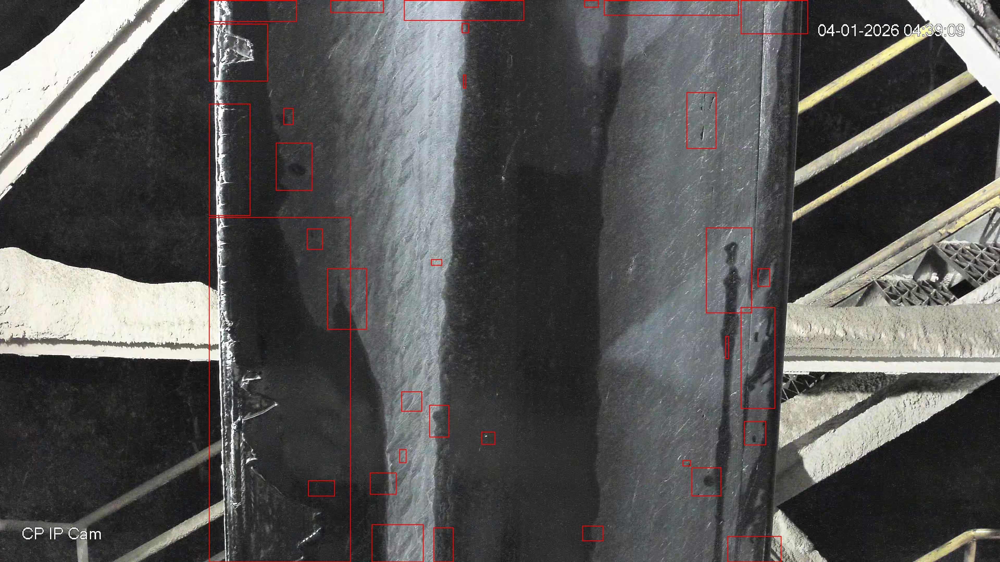
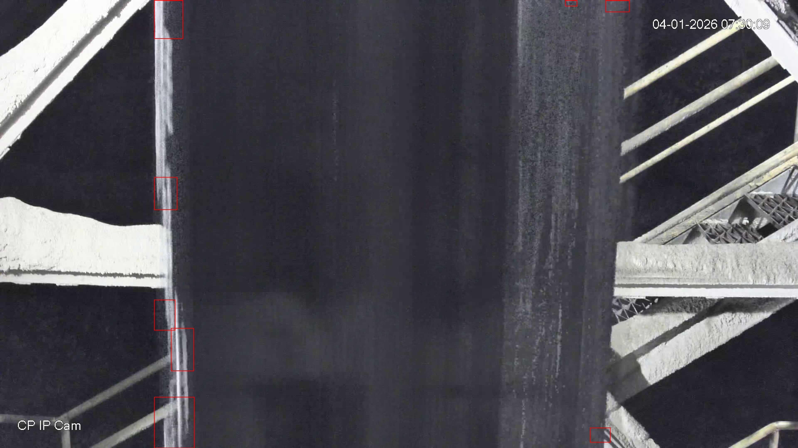

# ConveyCheck - Conveyor Belt Damage Detection

ConveyCheck is an anomaly-detection pipeline for conveyor belt inspection.  
It learns a representation of *normal* belt texture and flags unusual regions as potential damage (cuts, wear, cracks, or surface defects).

---

## Table of Contents

- [Overview](#overview)
- [How It Works](#how-it-works)
- [Repository Structure](#repository-structure)
- [Requirements](#requirements)
- [Quick Start](#quick-start)
- [Training](#training)
- [Inference](#inference)
- [Output Format](#output-format)
- [Sample Results](#sample-results)
- [Configuration Guide](#configuration-guide)
- [Troubleshooting](#troubleshooting)
- [Roadmap](#roadmap)

---

## Overview

This project is designed for industrial visual inspection where damaged areas are sparse and labels may be limited.

### Core capabilities

- ROI-focused analysis using polygon labels for belt area.
- Feature extraction using a ResNet backbone.
- Memory-bank based anomaly scoring.
- Threshold-driven detection and bounding-box generation.
- Outputs as both annotated images and machine-readable JSON.

---

## How It Works

1. **ROI extraction**  
   For each image, belt polygons from YOLO-style label files are converted to masks.

2. **Feature learning (training)**  
   The model extracts deep features from cropped belt regions and builds a memory bank of normal patches.

3. **Threshold estimation**  
   An anomaly threshold is computed from score distribution using a percentile (`--threshold_percentile`).

4. **Inference and localization**  
   For each new image, anomaly scores are mapped spatially, thresholded, and converted into connected regions.

5. **Post-processing**  
   Tiny detections are filtered (`--min_area`), remaining regions are drawn as red boxes, and saved to JSON.

---

## Repository Structure

```text
.
|-- train.py                 # Builds memory bank + threshold, saves model.pt
|-- pipeline.py              # Runs anomaly inference and writes outputs
|-- ripix_utils.py           # Shared utilities (features, masks, scoring, I/O)
|-- requirements.txt
|-- model/                   # Generated model artifacts
|-- outputs/                 # Generated annotated images + JSON
|-- train/
|   `-- train/
|       |-- images/          # Input training/inference images
|       `-- labels/          # ROI polygon labels (.txt)
`-- docs/
    `-- images/              # Images displayed in this README
```

---

## Requirements

- Python 3.9 or higher
- `pip`
- Linux/macOS/Windows (GPU optional)

Install dependencies:

```bash
pip install -r requirements.txt
```

Dependencies:

- `numpy`
- `pillow`
- `torch`
- `torchvision`

---

## Quick Start

Run full pipeline with default dataset paths:

```bash
# 1) Train model artifacts
python train.py \
  --image_dir train/train/images \
  --label_dir train/train/labels \
  --output_dir model

# 2) Run inference
python pipeline.py \
  --image_dir train/train/images \
  --label_dir train/train/labels \
  --model_dir model \
  --output_dir outputs
```

---

## Training

Create the anomaly memory bank and threshold:

```bash
python train.py \
  --image_dir train/train/images \
  --label_dir train/train/labels \
  --output_dir model \
  --threshold_percentile 98.5 \
  --max_patches 20000
```

### Main arguments (`train.py`)

- `--image_dir` (required): image folder.
- `--label_dir` (required): ROI polygon labels folder.
- `--output_dir` (required): where `model.pt` and `config.json` are saved.
- `--input_size` (default: `768`): image resize size for feature extraction.
- `--max_patches` (default: `20000`): max feature patches retained in memory bank.
- `--threshold_percentile` (default: `98.5`): higher value -> stricter anomaly trigger.
- `--no_enhance`: disables image enhancement before feature extraction.

Artifacts saved in `model/`:

- `model.pt` (memory bank + normalization stats + threshold)
- `config.json` (training metadata)

---

## Inference

Run anomaly detection on a set of images:

```bash
python pipeline.py \
  --image_dir train/train/images \
  --label_dir train/train/labels \
  --model_dir model \
  --output_dir outputs \
  --min_area 80
```

### Main arguments (`pipeline.py`)

- `--image_dir` (required): folder of images to inspect.
- `--output_dir` (required): folder to write annotated outputs.
- `--label_dir` (default: `train/train/labels`): ROI label folder.
- `--model_dir` (default: `model`): folder containing `model.pt`.
- `--min_area` (default: `80`): removes tiny connected components.
- `--no_enhance`: disables contrast enhancement.

Behavior note:

- If a matching label file is missing, the script uses the full image as ROI.

---

## Output Format

For each image, two files are generated:

- `outputs/<image_name>.jpg` -> annotated image with red bounding boxes.
- `outputs/<image_name>.json` -> dictionary of detected boxes.

JSON format:

```json
{
  "1": {
    "bbox_coordinates": [120, 44, 260, 118]
  },
  "2": {
    "bbox_coordinates": [300, 96, 410, 176]
  }
}
```

Coordinate order: `[x_min, y_min, x_max, y_max]` in pixels.

---

## Sample Results

| Result 1 | Result 2 |
|---|---|
|  |  |



---

## Configuration Guide

- **Increase sensitivity** (detect more):
  - lower `--threshold_percentile` in training (example: `97.5`)
  - lower `--min_area` in inference

- **Decrease false positives**:
  - increase `--threshold_percentile` (example: `99.0`)
  - increase `--min_area`
  - keep enhancement enabled (default) for low-contrast textures

- **Performance tuning**:
  - reduce `--input_size` for faster runtime
  - reduce `--max_patches` to lower memory usage

---

## Troubleshooting

### `Permission denied (publickey)` during `git push`

Your remote was using SSH without configured keys. Use HTTPS remote or set up SSH keys.

### Push hangs or is interrupted

Do not press `Ctrl+C` quickly; Git may be waiting for authentication.

### `Could not resolve host: github.com`

This is a network/DNS issue on your machine. Verify with:

```bash
ping -c 2 github.com
nslookup github.com
```

### `model.pt` not found

Run training first and ensure `--output_dir` matches `--model_dir` used at inference.

---

## Roadmap

- Add evaluation metrics (precision/recall) on labeled anomaly set.
- Add batch report summary (CSV).
- Add optional heatmap overlay outputs.
- Add Dockerfile for reproducible deployment.
